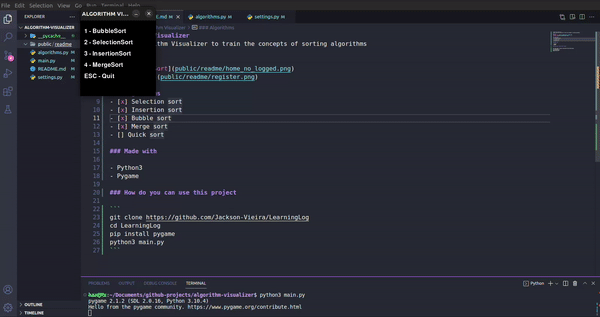

# Algorithm Visualizer
Simple Algorithm Visualizer to train the concepts of sorting algorithms

### GIF


### Algorithms
- [x] Selection sort
- [x] Insertion sort
- [x] Bubble sort
- [x] Merge sort
- [ ] Quick sort

### Made with

- Python3
- Pygame

### How do you can use this project

```
git clone https://github.com/Jackson-Vieira/Algorithm-Visualizer
cd Algorithm-Visualizer
pip install pygame
python3 main.py
```
